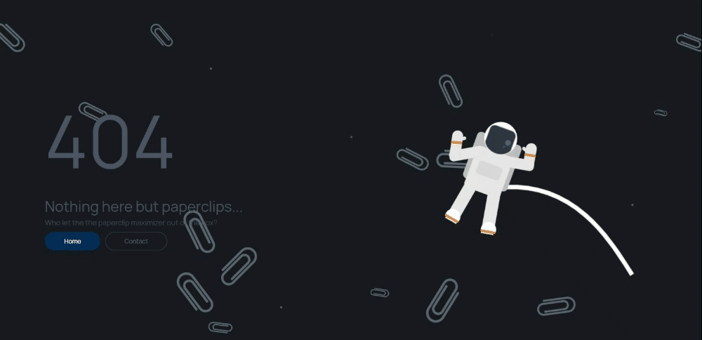

Ouch! This one hurts. Giving it up today after several months of intermittent struggle is what prompted me to create the graveyard in the first place.

Voxiversal was supposed to be the Next Big Platform, where people could post polls about topics in AI (its scope was going to be very narrow, I decided) and discuss their ideas through shortforms. It would equalize the often-unbalanced online discussion by *intensely* gathering user demographic data. Then, taking the results of all the polls, cross-referencing the demographics of the responders, and applying some Fancy Statistical Algorithms, it could accurately extrapolate what the actual distribution of global sentiment toward problems in AI, transhumanism, and co. looked like. Beyond the massive privacy concern of harboring basically every kind of data about users legally-allowable, I think I completely ignored the issue of botting and intentional data manipulation (plus the fact that unless my statistical algorithms were literally perfect, they'd probably just confound the issue further, rather than giving meaningful data about global preferences).

# Post-mortem
Voxiversal was supposed to be my premier project this year. The idea felt awesome, the time felt right, and the project timeline felt short. I still believe two of those things. The fact is, the project's unique nature meant it was simply impossible to build fast. It took almost two weeks to get the home page - *the home page!* - drafted up in WebFlow. Each of the following pages would take at least a few days, and everything relied on a heavy dose of Firebase, a technology I did not understand. I jumped around a bit, trying to find a way to complete the project satisfactorily that wouldn't take the entire summer. I scrapped the entire initial design and downloaded a React hackernews redesign, wanting to adapt its UI to fit the project. When that proved impossible, I tried Manifold Markets. Though the overall idea of the site isn't dramatically different from Voxiversal, it was so monolithic and so secure in its identity as a market site that it just *wouldn't adapt* to my idea. I tried just pulling individual components from it to speed up dev, but that also failed, and the impending sense of doom at how massive my backend would have to be to accomodate the app just sinking in pushed me over the edge. After a few hundred (?) hours wasted I quit. So, basically:
- Too big an idea for one dev to build
- And, no really good existing paradigm to leverage really doomed the project. Also, the high probability that it would fail even if I did build the entire thing made me wary to put in too much more effort. 

Some choice cuts of code from this one:
- The 404 page
- The home page
- The actual idea? I'll be honest, I didn't get to writing much code for this one, which is a relief.

<i>The 404 page. Looks sick, right?</i>

